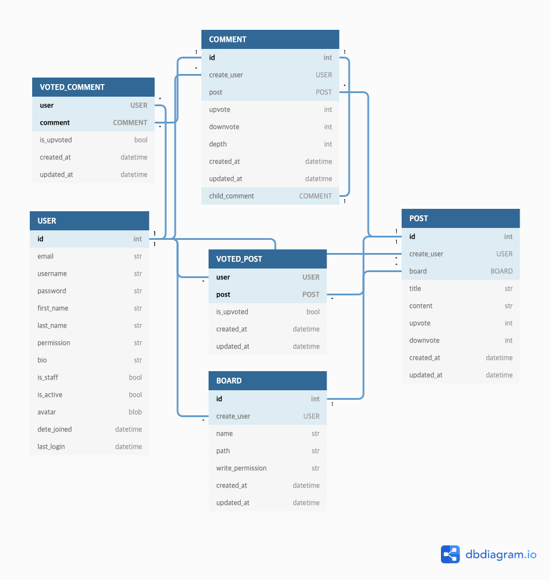

## Dynamic Board Backend

 

### Author : [Kim Minsu](https://github.com/alstn2468) [ [Facebook](https://www.facebook.com/profile.php?id=100003769223078) ] [ [Github](https://github.com/alstn2468) ] [ [LinkedIn](https://www.linkedin.com/in/minsu-kim-336289160/) ] [ [Blog](https://alstn2468.github.io/) ] 

API documents can be found [here](https://github.com/alstn2468/Dynamic_Board_Backend/blob/master/DOCUMENT.md).

### 🗺️ Diagram

### ⚙️ Function

### ⏰ To Do

- [ ] Document
- [ ] View Logic
- [ ] Model Class
- [ ] Authentication
- [ ] Url Configuration
- [x] Model Structure Design
- [x] CI Environmental Construction
- [ ] CD Environmental Construction
